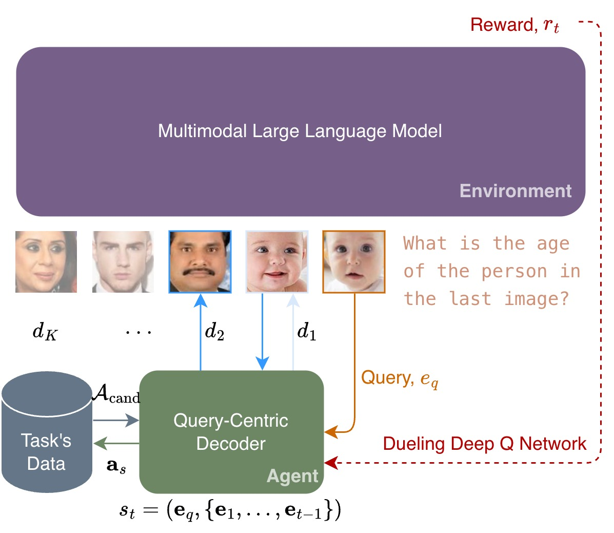

# Learning to Select Visual In-Context Demonstrations



This is the official repository for the CVPR 2026 paper, **Learning to Select Visual In-Context Demonstrations**. 

Our framework, Learning to Select Demonstrations (LSD), reframes K-shot demonstration selection as a sequential decision-making problem. We utilize a Dueling Deep Q-Network (DQN) agent with a query-centric Transformer Decoder to actively balance visual relevance with diversity, constructing optimal demonstration sets for visual regression tasks.

---

## Setup

```bash
cd Learning-to-Select-Visual-In-Context-Demonstrations
conda create -n LSD python=3.10 -y
conda activate LSD
pip install -r requirements.txt

```

---

## Process Data

### 1. Download Dataset

Download the datasets from the following sources:

* **Age Prediction (UTKFace)** https://susanqq.github.io/UTKFace/
* **Aesthetic Score (AVA)** https://www.kaggle.com/datasets/nicolacarrassi/ava-aesthetic-visual-assessment
* **Facial Beauty (SCUT-FBP5500 v2)** https://www.kaggle.com/datasets/pranavchandane/scut-fbp5500-v2-facial-beauty-scores
* **Wild Image Quality (KonIQ-10k)** https://database.mmsp-kn.de/koniq-10k-database.html
* **Modified Image Quality (KADID-10k)** https://database.mmsp-kn.de/kadid-10k-database.html

### 2. Prepare Dataset

```bash
./scripts/prepare_data.sh

```

### 3. Update datasets.yaml

---

## LSD Training

```bash
./scripts/train_lsd.sh

```

> **Note:** Results will be saved in the `train_res` directory.

## LSD Evaluation

```bash
./scripts/eval_lsd.sh

```

> **Note:** Results will be saved in the `eval_res` directory.

---

## Citation

If you find this work helpful or use our code in your research, please consider citing our paper:

```bibtex
@inproceedings{lee2026learning,
  title={Learning to Select Visual In-Context Demonstrations},
  author={Lee, Eugene and Lin, Yu-Chi and Diao, Jiajie},
  booktitle={Proceedings of the IEEE/CVF Conference on Computer Vision and Pattern Recognition},
  pages={9455--9465},
  year={2026}
}

```

